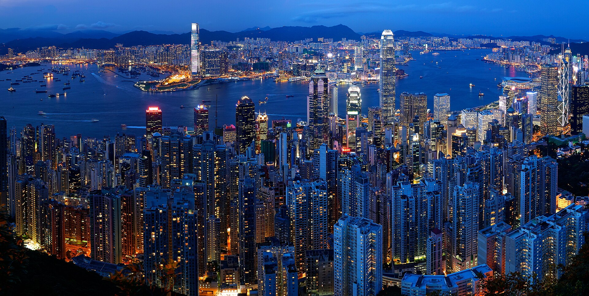
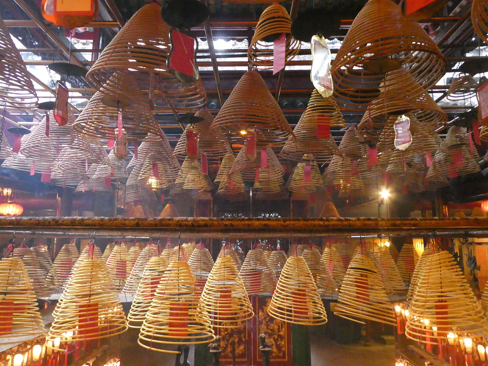
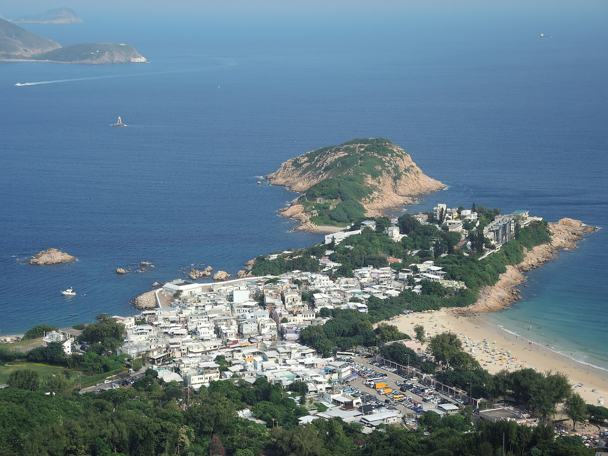
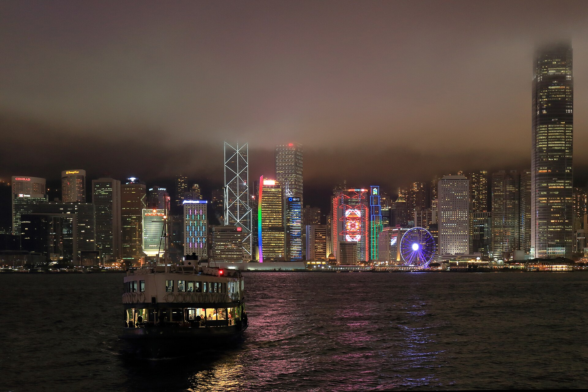

4 nights, Oct 23–27. Home base for the first half of the trip, with a big hiking day, serious dim sum, and one island day-trip.

_Victoria Harbour from Victoria Peak at dusk. Photo by Romain Pontida via [Wikimedia Commons](https://commons.wikimedia.org/wiki/File:Skyline_and_Victoria_Harbour_at_dusk,_view_from_Victoria_Peak,_Hong_Kong,_China_-_%E9%A6%99%E6%B8%AF%EF%BC%8C%E4%B8%AD%E5%9B%BD_(16215094838).jpg); CC BY-SA 2.0._

## Map

Preview the major scenic stops on [Google Maps](https://www.google.com/maps/dir/Man+Mo+Temple,+Hong+Kong/Dragon%27s+Back,+Hong+Kong/Victoria+Peak,+Hong+Kong/Avenue+of+Stars,+Hong+Kong/Lamma+Island,+Hong+Kong/). Use it as a planning view; the mainland legs should still follow the Amap/Apple Maps setup in [[logistics#Maps]].

## Where to stay

Base in **Sheung Wan** — Central's cooler, more interesting neighbor, one MTR stop away, better value. Traditional dried-seafood shops + art galleries + third-wave coffee side by side.

| Hotel | Area | Why | Price |
|---|---|---|---|
| **The Figo** (pick this) | Sheung Wan | Residential boutique feel, 8.6/10 | ~$180–240 |
| The Pottinger | Central | Asia's Best City Boutique Hotel | ~$350 |
| 99 Bonham | Sheung Wan | Apartment-style suites, Italian design | ~$200 |

## Day 1 — Fri Oct 23 — arrive, slow Sheung Wan evening

- Land HKG ~late morning (after 15-hr overnight flight). Airport Express → Hong Kong Station → taxi to hotel.
- Nap. Seriously, nap.
- Late afternoon: wander Sheung Wan on foot. **Tai Ping Shan Street**, **PMQ** (old police married quarters, now design studios), end at **Man Mo Temple** for golden hour — incense coils hanging from the ceiling.
- Dinner: **Kam's Roast Goose** — 1 Michelin star (confirmed on 2026 Guide), 226 Hennessy Rd, Wan Chai, walk-in, only 30 seats so expect a queue. Alternative: **Yat Lok** on Stanley St, Central — also 1-star roast goose, tighter shop, lunch-only vibe best.

_Man Mo Temple's incense-coil ceiling in Sheung Wan. Photo by Aethelfirth via [Wikimedia Commons](https://commons.wikimedia.org/wiki/File:Burning_incense_coils_in_the_Man_Mo_temple_(Hong_Kong).jpg); CC BY-SA 4.0._

## Day 2 — Sat Oct 24 — Dragon's Back hike + Peak at blue hour

This is the big outdoor day.

- Early breakfast. MTR to **Shau Kei Wan** → Bus **9** to **To Tei Wan** on Shek O Road → trailhead.
- **Dragon's Back hike**: ~4 hrs end-to-end, moderate. Ridgeline views to Shek O, Big Wave Bay, South China Sea. Consistently ranked Asia's best urban hike.
- Finish at **Big Wave Bay**. Swim if warm (still feasible late Oct), otherwise beer at the surf shack.
- Bus 9 back to Shau Kei Wan, MTR back to Central.
- Late lunch: **Lin Heung Lau** — 100-year trolley yum cha institution. The legendary Central location (Wellington St) closes end-March 2026 for building redevelopment; the new location is at **Tung Ning Building, 249–251 Des Voeux Road Central, Sheung Wan** (opens early April 2026, so fully operational by October). There's also a 24-hour branch in TST if schedules miss. Backup tamer alternative: **One Harbour Road** at Grand Hyatt.
- Evening: **Victoria Peak via the Peak Tram**. **Reserve timed entry on Klook in advance** — the standby queue is miserable. Stay through **blue hour** (~18:00) for the iconic skyline shot.
- Dinner: **Ho Lee Fook** in SoHo — inventive modern Cantonese, great room, cocktails.

_The ridgeline section of Dragon's Back. Photo by ChInG_* via [Wikimedia Commons](https://commons.wikimedia.org/wiki/File:Dragon%27s_Back,_Hong_Kong_02.jpg); CC BY-SA 2.0._

## Day 3 — Sun Oct 25 — Kowloon + street markets

- Dim sum breakfast: **Tim Ho Wan** — the modernized flagship is in TST (North, Rm 12A, 2–8 Sai Yeung Choi St) since late 2024. From Sheung Wan, the Central branch (IFC Mall) or the 10th-outlet Kowloon location (Mikiki Mall, opened Feb 2026) are both easier. Baked char siu bun is the signature order.
- **Star Ferry** to Tsim Sha Tsui (~10 min, HKD 5, skyline view included).
- Walk the **Avenue of Stars** and Kowloon waterfront.
- Lunch: **Mak's Noodle** (TST location) — wonton noodles, 3rd-gen family shop, lunch only.
- Afternoon in **Sham Shui Po** — gritty, local, best street eats in the city:
  - **Apliu Street electronics market** — salvage paradise
  - **Kung Wo Tofu Factory** — dau fu fa (tofu pudding)
  - **Sun Hing Restaurant** for late snack dim sum
- Evening: **Temple Street Night Market** (Yau Ma Tei). Dinner at one of the dai pai dong seafood stalls — clams in black bean sauce, salt-and-pepper prawns, cold beer.

_Night skyline from the Star Ferry approach across Victoria Harbour. Photo by Wilson Hui via [Wikimedia Commons](https://commons.wikimedia.org/wiki/File:Hong_Kong_Skyline_at_Night_-_Star_Ferry_-_Flickr_-_Wilson_Hui.jpg); CC BY 2.0._

## Day 4 — Mon Oct 26 — island day trip

Pick one:

- **Lamma Island** (recommended for us). Ferry from Central Pier 4 to Yung Shue Wan (~30 min). Easy hike **Yung Shue Wan → Sok Kwu Wan** (~1.5 hr, mostly flat, sea views). Seafood lunch at **Rainbow Seafood** in Sok Kwu Wan. Ferry back.
- **Lantau** — Ngong Ping cable car → **Tian Tan Buddha** → **Tai O fishing village** on stilts. Full day, more famous but more touristy.
- **Macau** — TurboJET ferry 1 hr. Portuguese colonial core + egg tarts at Lord Stow's. Separate entry stamp, factor immigration time (can be 30+ min either way).

Lamma is the pick for an active couple — zero crowds, the best seafood lunch of the trip, and the hike itself is the attraction.

**Farewell HK dinner**: **Lung King Heen** at the Four Seasons — the first Chinese restaurant to hit 3 Michelin stars (held for 14 years); dropped to **2 stars** in 2023 but still world-class. Book 30+ days ahead, and note the HKD 700 + 10% service minimum spend per person effective Jan 1, 2026. Alternative: **Yardbird** — yakitori + whisky, at 154–158 Wing Lok St, Sheung Wan. Takes reservations via Tock, Mon–Sat 18:00–midnight, closed Sundays.

## Day 5 — Tue Oct 27 morning — transfer

- Breakfast dim sum: **One Dim Sum** (Shop 1 & 2, G/F, Kenwood Mansion, 15 Playing Field Rd, Prince Edward) — 1 min from Prince Edward MTR. Michelin-starred in 2012–2013 and now a Bib Gourmand; portions are tiny and cheap. 45-min queue typical.
- MTR to **West Kowloon Station** (or walk from Sheung Wan if you pack light).
- **10:00–11:00 G-train → Guangzhou South**. See [[transport#Hong Kong West Kowloon → Guangzhou South]].
- Arrive Guangzhou ~noon. On to [[guangzhou]].

## Restaurants at a glance

| Place | Type | When |
|---|---|---|
| Kam's Roast Goose | Cantonese BBQ, 1-star | Day 1 dinner |
| Lin Heung Lau (new Sheung Wan branch) | Trolley yum cha | Day 2 lunch |
| Ho Lee Fook | Modern Cantonese | Day 2 dinner |
| Tim Ho Wan (Central IFC branch) | Dim sum | Day 3 breakfast |
| Mak's Noodle | Wonton noodles | Day 3 lunch |
| Lung King Heen | 2-star Cantonese (was 3-star 2008–2022) | Day 4 splurge dinner |
| Yardbird (Sheung Wan) | Yakitori | Day 4 alt dinner |
| One Dim Sum | Bib Gourmand dim sum | Day 5 breakfast |
| Luk Yu Tea House | Classic yum cha, dim sum until 18:00 | Alt |
| Yat Lok | 1-star roast goose | Quick lunch alt |
