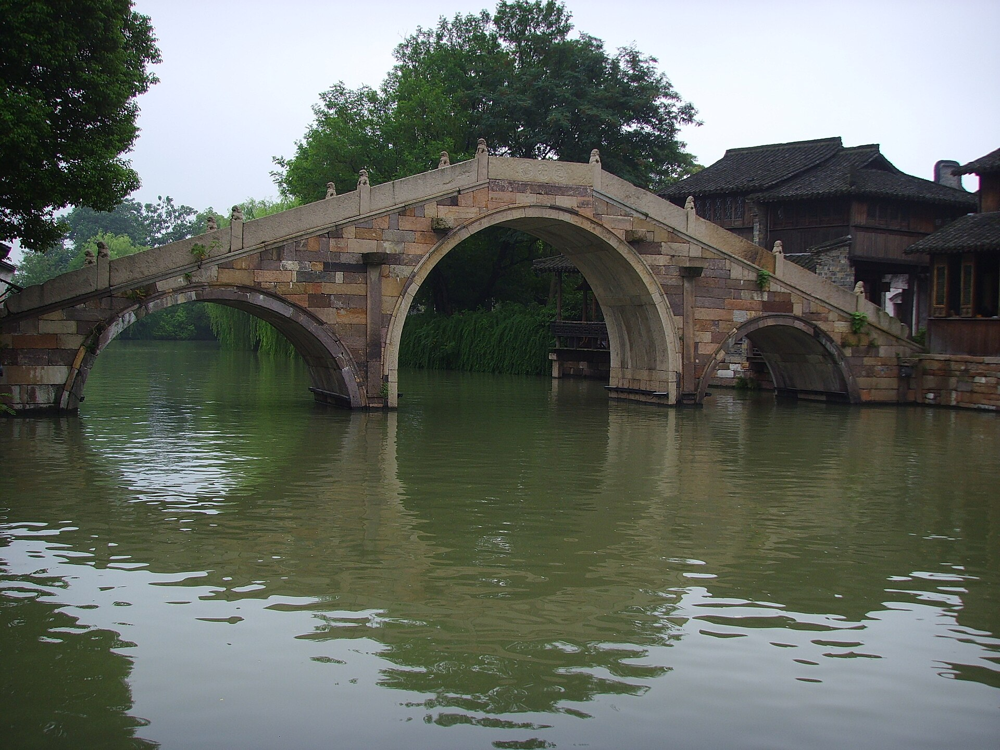
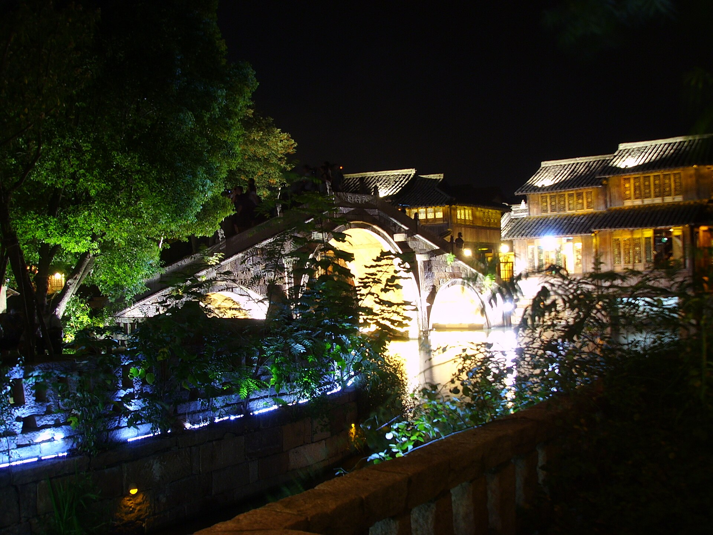
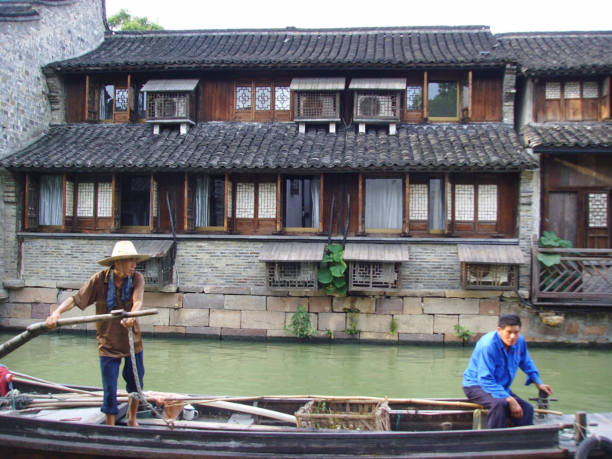
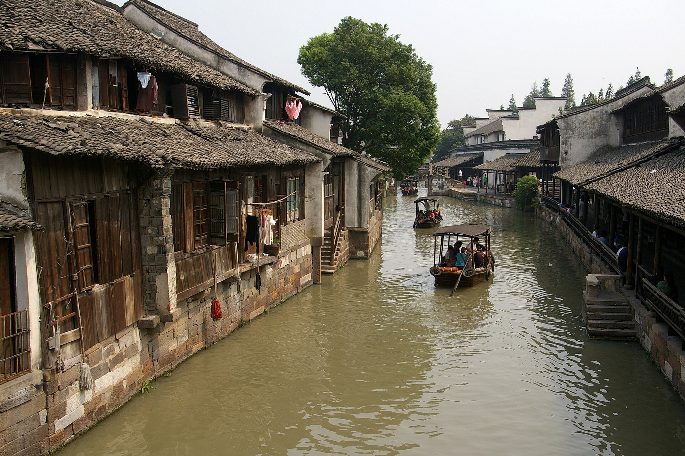

2 nights, Oct 30 – Nov 1. The scenic-town stop. Whitewashed houses, dark wooden buildings, stone bridges, lantern-lit waterways — the canal-town China of the imagination. Wuzhen is in Zhejiang, roughly between Hangzhou and Shanghai.

_A stone bridge inside Wuzhen Xizha. Photo by Gerbil via [Wikimedia Commons](https://commons.wikimedia.org/wiki/File:Wuzhen_Xizha_2009-09.jpg); CC BY-SA 3.0._

## Map

Preview the Wuzhen stop on [Google Maps](https://www.google.com/maps/dir/Wuzhen+Xizha+Scenic+Area/Wuzhen+Dongzha+Scenic+Area/Tongxiang+Railway+Station/). Use it as a planning aid; for live mainland navigation once you're there, keep using the Amap/Apple Maps setup in [[logistics#Maps]].

## Critical: stay INSIDE the West Scenic Zone

**Non-negotiable.** The whole reason to come to Wuzhen is the empty canals at night and dawn — which you only get if you hold a guesthouse card that re-admits you to the scenic zone freely.

Day-trippers leave by ~18:00. After that the West Zone (Xizha) empties out. Lanterns come on. That's the trip.

If you stay in Tongxiang City (cheaper) you miss the entire thing.

### Hotel options

| Hotel | Type | Price |
|---|---|---|
| **Wuzhen Guesthouse West Scenic Zone, waterfront suite** (splurge) | Premium inside Xizha | ~CNY 2,000 |
| **Tong'an Inn** (recommended) | Courtyard-style inn, breakfast incl. | ~CNY 800 |
| Various other inns inside Xizha | Simpler rooms | CNY 300–600 |

**Book direct** at [en.wuzhen.com.cn](http://en.wuzhen.com.cn/web/traver/periphery). Many of the good rooms don't appear on Booking.com or Trip.com. Book 2 months out.

**Ticket logic:** West Scenic Zone admission is **CNY 150/person**, zone open **09:00–22:00**. A single-day ticket is good for one entry only — if you walk out, you can't re-enter on the same ticket. If you stay inside the zone, bring your room card + ID + original ticket to the service center to get a pass for **free re-entry** during your stay. This is why staying inside is non-negotiable for the dawn + night walks.

## Day 1 — Fri Oct 30 — afternoon arrival + canal night walk

- Arrive at the West Gate by ~14:00 via HGH transfer. Check in, drop bags.
- Afternoon: leisurely walk Xizha (West Scenic Zone). Don't rush. Key stops:
  - **Baogeng Bridge** — iconic arched stone bridge over the main canal
  - **Caoben Dyeing Workshop** — indigo cloth drying on racks, looks incredible in photos
  - **Water Market** — the morning produce boats
  - **Yida Silk Workshop** — live silk weaving
- **Dusk boat ride** — included with the scenic-zone ticket. ~40 min, gondola-style.
- Dinner canalside: try **Wuzhen sauce-braised mutton** and **Sanbai Wine** (local triple-white rice wine). Any inn-adjacent restaurant works.
- **21:00+ canal walk.** This is the moment. Day-trippers gone, lanterns reflecting off the water, footsteps on stone. Bring a real camera if you own one.

_Lantern-lit bridge scene in Wuzhen Xizha at night. Photo by Gerbil via [Wikimedia Commons](https://commons.wikimedia.org/wiki/File:Wuzhen_Xizha_2009-13.jpg); CC BY-SA 3.0._

## Day 2 — Sat Oct 31 — sunrise + both scenic zones

- **06:30 sunrise walk** in Xizha. Monks, morning fog, zero tourists. The single best photo hour of the whole trip.
- Breakfast: **Wuzhen Zao Cha Ke** (Morning Teahouse) — local breakfast of congee, savory pancakes, tea, inside the scenic area.
- Mid-morning: take the **free shuttle bus** to **Dongzha (East Scenic Zone)**. Smaller, more museum-heavy, 2–3 hrs is plenty.
  - **Shadow Puppet Theater** (scheduled shows)
  - **Jiangnan Woodcarving Museum**
  - **Mao Dun's Former Residence** (Wuzhen's most famous writer, early 20th c.)
- Lunch in Dongzha: **Gongsheng Restaurant** — classic Jiangnan water-town cuisine. White-water fish, vegetable stir-fries with rice wine.
- Afternoon: shuttle back to Xizha. **Rent bikes** and ride the rural canal path **outside** the zone — fall rice fields, farmers, mostly-empty back lanes. 2 hrs easy.
- Sunset: rooftop/courtyard of the guesthouse.
- Dinner: **Wuzhen Senior Chef Restaurant** inside the zone. Order **white-water fish**, **Gubei duck**, **hongshao rou** (red-braised pork belly).
- Evening: one more canal walk. Catch **Jiangnan Baichuang** if it's running — lantern-lit water performance.

_The central canal corridor in Wuzhen Xizha. Photo by Gerbil via [Wikimedia Commons](https://commons.wikimedia.org/wiki/File:Wuzhen_Xizha_2009-11.jpg); CC BY-SA 3.0._

_Classic canal-and-boat scene in Wuzhen. Photo by Jakub Hałun via [Wikimedia Commons](https://commons.wikimedia.org/wiki/File:20090913_Wuzhen_5021.jpg); CC BY-SA 4.0._

## Day 3 — Sun Nov 1 morning — transfer to Shanghai

- Early breakfast in the zone.
- Taxi to **Tongxiang station** (~25 min, CNY 80).
- G-train Tongxiang → Shanghai Hongqiao (30 min, CNY 60). See [[transport#Tongxiang → Shanghai Hongqiao]].
- Metro Line 2 east into central Shanghai. On to [[shanghai]].

## Notes

- Admission to Xizha: CNY 150 adult, valid for the length of your stay if you have a room inside.
- Shuttle between Xizha and Dongzha is free; runs every ~15 min.
- Dongzha gets most of the Chinese tour-group traffic; Xizha is the evening/romantic zone.
- Weather late October: ~15–20 °C, bring a light jacket.
